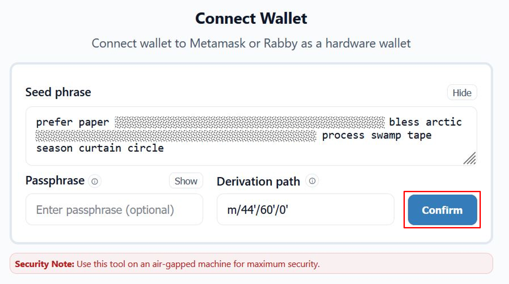
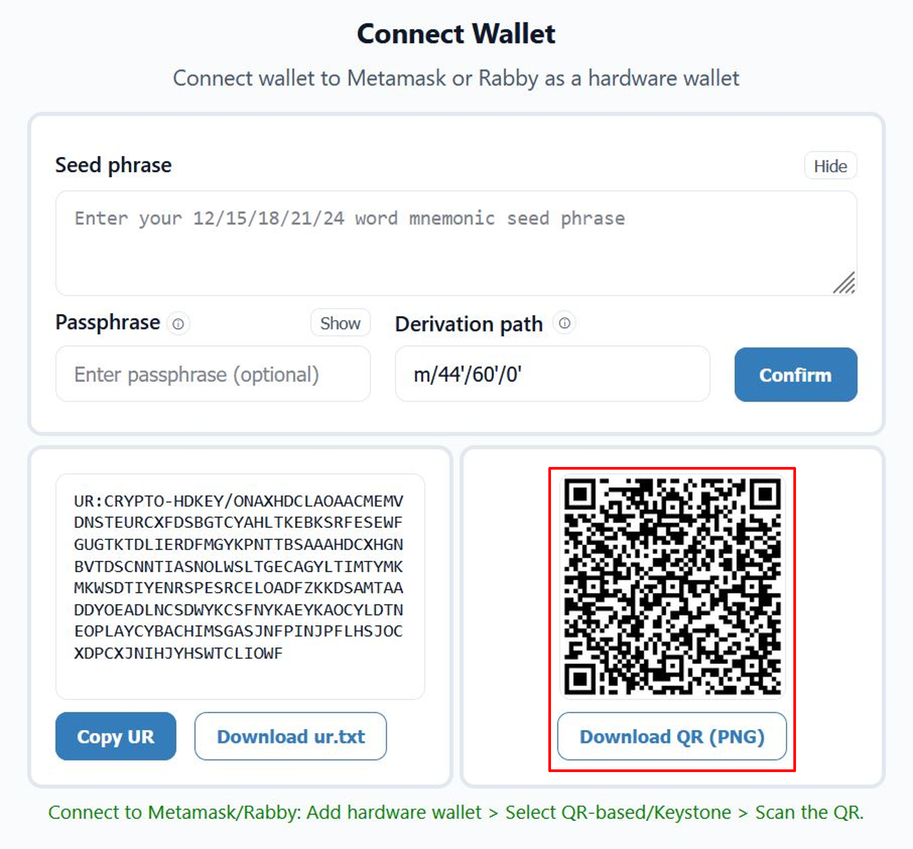
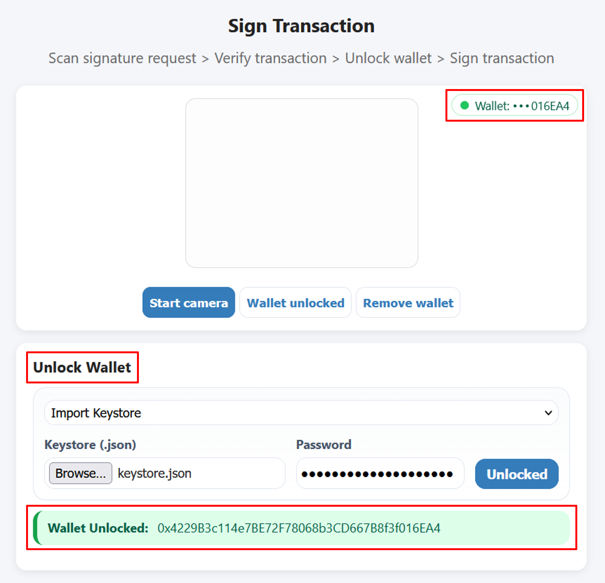

# Metastream

A solution for creating Ethereum wallets and securely signing transactions offline using air-gapped devices.


#### Security Tip: Use this application only on a permanently air-gapped machine for maximum security.
#### Warning: Never type your cold wallet or hardware wallet seed phrase on a device that connects to the internet.

<h2 style="margin-top: 12px; martin-top: 12px;">Description</h2>

Metastream is a secure offline wallet solution that lets you manage ethereum wallets and sign transactions without exposing private keys to the internet or any third-party software. It runs on fully air-gapped systems and uses controlled, one-way communication using QR codes to securely authorize transactions. Metastream offers similar security features to a hardware wallet without needing a dedicated device. 

<h2 style="margin-top: 12px;">Features</h2>

- Completely offline
- Completely air-gapped, no wired/wiresless connections required
- Create new ethereum wallets
- Optional passphrase support
- Generate seed phrase through dice roll & coin flip
- Find the last word (checksum) for a manually generated seed phrase 
- Supports custom derivation paths (m/44'/60'/n'/)
- Encrypt and export wallet as a keystore file (UTC/JSON)
- Connect any wallet to Metamask or Rabby as a hardware wallet
- Sign transactions using QR codes.
- Virutal keyboard

<h2 style="margin-top: 12px;">Know How To</h2>

### Create a new wallet

Choose from 12/15/18/21/24 words for the mnemonic seed phrase. Optionally use a passphrase and a custom derivation path.

A seed phrase is generated by creating cryptographically secure entropy using ethers.randomBytes(bytes) and converting that entropy into a BIP-39 mnemonic seed phrase. This ensures the resulting seed phrase has sufficient randomness for secure key generation.

<p align="center"></p>

### Export wallet

Export the newly created wallet as an encrypted keystore file.

The keystore file encrypts the private key with a user-defined password and stores it in a UTC/JSON file. The password must be strong and securely kept. The encryption process is designed to resist brute-force attacks by making each password guess computationally expensive. Losing the password means the private keys are permanently lost. It is always recommended to also back up the seed phrase as a reliable recovery method.

<p align="center"></p>

### Dice roll & Coin flip

Do not trust the seed phrase generated by a machine? Use this tool generate a seed phrase using 5 dice rolls and a coin flip. 

The method generates seed entropy using physical randomness from dice rolls and coin flips, which are mapped to BIP-39 words using a predefined table. The predefined table can be found [here](https://bitbox.swiss/bitbox02/BitBox_Diceware_LookupTable.pdf). This process determines the first words (n-1) of the seed phrase, while the final word is calculated as the checksum.

<p align="center"></p>

### Find last (checksum) seed word 

Find the last word for a manually generated seed phrase. Enter n-1 words generated using dice roll & coin flip or any other method. Choose a word from the list all valid last words that satisfy the checksum. 

<p align="center"></p>

### Connect wallet

Connect a newly created wallet or any other wallet to Metamask or Rabby as a hardware wallet. 

<p align="center"></p>

Obtian a BC-UR encoded CRYPTO-HDKEY from a seed phrase (optional passphrase and custom derivation path). Using UR:CRYPTO-HDKEY QR codes, any wallet can interact with MetaMask or Rabby in the same way as a hardware wallet (e.g. Keystone, Onekey, nGRAVE), effectively emulating hardware wallet behavior without a direct physical connection and without exposing the private keys. 

<p align="center"></p>

Scan the generated UR:CRYPTO-HDKEY QR code with Metamask or Rabby to connect the wallet.

<p align="center"></p>

### Sign Transaction

Initiate a transaction from the wallet connected to Metamask or Rabby and obtian a signature request QR code. Scan this QR code with Metastream and verify the transaction details. Metastream provides key transaction details including the chain ID, the receiver address, token type, and most importantly the amount. It is of utmost importance to make sure that Metastream shows exactly the same transaction details that were used to initiate the transaction using Metamask or Rabby.

<p align="center"></p>

After verifying the transaction details proceed to safely unlock a wallet. A wallet can be unlocked using a keystore file (.json), a private key file (.txt), a private key, a mnemonic seed phrase or, a mnemonic seed phrase + passphrase. Successfully unlocking a wallet shows the public address of the wallet.   


<p align="center"></p>

Sign the transaction after unlocking the wallet to generate a signature QR code. Scan this signature QR code using the 'Get Signature' option in Metamask/Rabby to complete the transaction. Since the entire transaction signing process happens through QR codes, no wired or wireless connection is required between Metamask/Rabby and Metastream.  

<p align="center"></p>

### Virtual Keyboard

Use the inbuilt virtual keyboard to add an extra layer of security for sensitive details such as the seed phrase, passphrase and keystore password. Virtual keyboards are important for crypto wallets because they reduce exposure to keyloggers and other malware that capture physical keystrokes.

<p align="center"></p>

<h2 style="margin-top: 12px;">Hardware-wallet-level security</h2>

The security model of Metastream is designed around strict offline isolation and true air-gapped operation. Metastream can be deployed on a physically isolated system that has no wired or wireless connectivity of any kind, eliminating remote attack vectors. In this configuration, private keys are generated, stored, and used exclusively on an offline device and are never exposed to the internet, browser extensions, or any other software wallet. Transaction data is transferred in a controlled, one-way manner via QR codes, ensuring that signing occurs entirely offline. When installed on a live, encrypted Linux distribution such as Tails or MX Live, with all networking drivers removed, Metastream can theoretically approach hardware-wallet–level security. By creating a new wallet, encrypting it as a keystore file, and storing that file on a dedicated encrypted flash drive (e.g., a Kingston IronKey), the attack surface is reduced to the minimum. This provides strong protection against malware, key loggers, and supply-chain risks commonly associated with online or browser-based wallets.

<h2 style="margin-top: 12px;">Supply chain attacks</h2>

In recent years, multiple cryptocurrency wallets have been targeted by attackers attempting to steal users’ funds, with supply chain attacks being a common attack vector. In such attacks, an adversary compromises a third-party dependency to inject malicious code into a wallet. Metastream deliberately sources dependencies only from well-established and reputable hardware wallet developers such as Keystone, OneKey, and NGRAVE, whose products and security practices are widely trusted within the cryptocurrency ecosystem.

#### Disclaimer: Metastream’s security model relies on the continued integrity and trustworthy behavior of these upstream projects. If any of these dependency providers were to act maliciously, become compromised, or deviate significantly from accepted security practices, it would be inadvisable to use Metastream until the risk has been properly assessed and mitigated.

<h2 style="margin-top: 12px;">Build</h2>

Verify node.js installation:

```bash
node --version
npm --version
```

Minimum requirements: Node.js v20; npm v9


Clone the repo:

```bash
git clone https://github.com/chahatmandviwala-alt/Metastream.git
```


Install the dependencies:

```bash
npm install
```

Run locally in any browser:

```bash
npm run start
```


Alternatively autorun in the default browser (on Linux):

```bash
./Metastream.sh
```


Alternatively autorun in the default browser (on Windows):

```bash
./Metastream.bat
```


<h2 style="margin-top: 12px;">Disclosing Security Vulnerabilities</h2>

If you discover a security vulnerability within this application, please send an e-mail to chahat.mandviwala@gmail.com. All security vulnerabilities will be promptly addressed.

<h2 style="margin-top: 12px;">Support the Project</h2>

If this project has been helpful and you’d like to support my work, contributions are always appreciated.
You can contribute using ETH or any ERC-20 token by sending it to: **`0x1ce87a3a77337aAcA113Aa1C205b272d492097dc`**.
Every bit helps and is sincerely appreciated.
