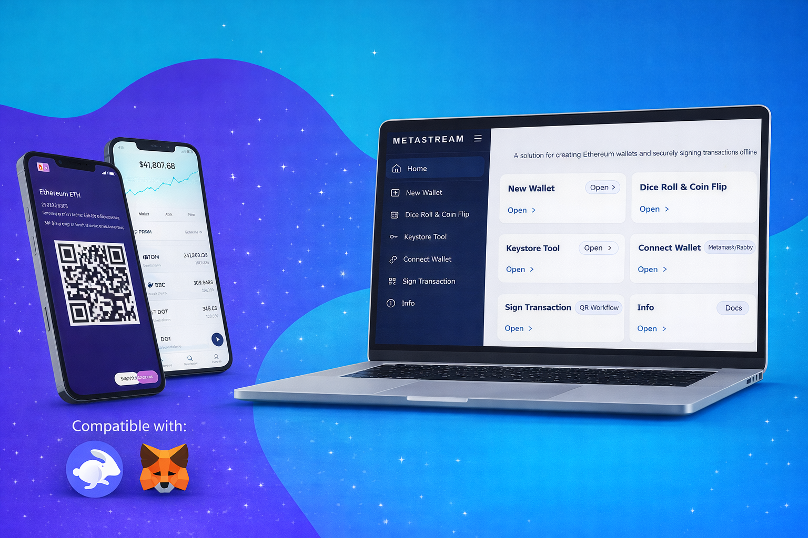

# Metastream

A solution for creating Ethereum wallets and securely signing transactions offline using air-gapped devices.

<br>



#### Security Tip: Use this application only on a permanently air-gapped machine for maximum security.
#### Warning: Never type your cold wallet or hardware wallet seed phrase on a device that connects to the internet.

## Description

- TBC

## Features

- TBC
- TBC
- TBC

## Security

The security concept behind using air-gapped systems for signing transactions is to work with two physically separated devices, one of which has no connection to the outside world or any network. In this context, connecting your paper wallet with Metamask/Rabby allows you to watch your paper wallet and sign transactions through one-way communication using QR codes. This tool is only for connect paper wallet to Metamask or Rabby.

## Build

Clone the repo:

```bash
git clone https://github.com/chahatmandviwala-alt/Metastream.git
```


Install the dependencies:

```bash
npm install
```

Run locally in any browser:

```bash
npm run start
```

Alternatively run locally in default browser:

```bash
./Metastream.bat
```


## Disclosing Security Vulnerabilities

If you discover a security vulnerability within this application, please send an e-mail to chahat.mandviwala@gmail.com. All security vulnerabilities will be promptly addressed.


## Related Projects

- TBC
